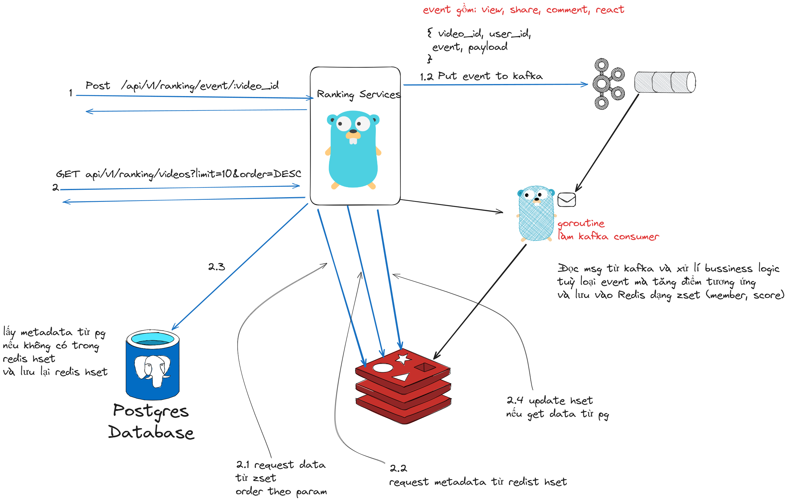

# Realtime Video Ranking

### High Level Design



- Dùng Redis (ZSet) để lưu ranking, (HSET) để lưu metadata
- Postgres làm db chính nơi lưu trữ metadata của video
- Kafka làm Message Queue để xử lí event theo bất đồng bộ
- Sử dụng EDA + DDD parttern


### Code Struct

```
project-name/
├── cmd/
│   └──  main.go                 

├── internal/
│   ├── application/                # Application layer
│   |   |── video_service.go        # Xử lí bussiness logic
│   |   └── ranking_service.go
|   |
|   ├── config/
│   |   ├── config.go                   # Config
|   |
│   ├── domain/                     # Domain layer
│   │   ├── models/                 # Entity liên quan đến ranking
│   │   │   ├── category.go
│   │   │   ├── event.go
│   │   │   └── score.go            
│   │   │   └── user.go            
│   │   │   └── video.go            
│   │   ├── repository/             # Interface cho repositories
│   │   │   ├── cached_repository.go
│   │   │   ├── ranking_repository.go
│   │   │   └── video_repository.go
│   ├── infrastructure/             # Infrastructure layer
│   │   ├── messaging/              # Kafka
│   │   │   ├── kafka_producer.go        
│   │   │   ├── score_consumer.go  
│   │   ├── persistence/
│   │   │   ├── postgres/         
│   │   │   │   ├── connection.go
│   │   │   │   ├── postgres_video_repository.go 
│   │   │   └── redis/              
│   │   │       ├── connection.go
│   │   │       ├── ranking_repository.go  # Chỗ này dùng để get và add score video
│   │   │       └── cached_repository.go   # Dùng để get video metadata trong cached
|   |   
│   └── interfaces/                 # Interface layer
│       ├── api/
│       │   ├── dto/              
│       │   │   ├── event.go
│       │   ├── handler/            # API handler  
│       │   │   ├── ranking_handler.go
│       │   │   ├── handler_helper.go
│       │   ├── responses/              
│       │   │   ├── response.go
│       │   ├── router/             # API router
│       │   │   ├── router.go
│
├── pkg/                           # Mã dùng chung, tiện ích
│   └── errors/
│       └── errors.go
│
├── scripts/              
│   ├── seed.go  #Mock scripts tự động call api add event
│
├── docs/                          
│   ├── api/
│   │   └── swagger.yaml
│   └── architecture/
│       └── ddd.md
│
├── config.yaml                    # Env
├── go.mod
├── go.sum
├── Dockerfile                     # Docker file cho app
├── Dockerfile.mock                # Docker file cho scripts
├── docker-compose.yml             # Setup Postgres & Redis
└── readme.md
```


### Cách chạy ứng dụng
Sử dụng docker compose
```
docker compose up
```